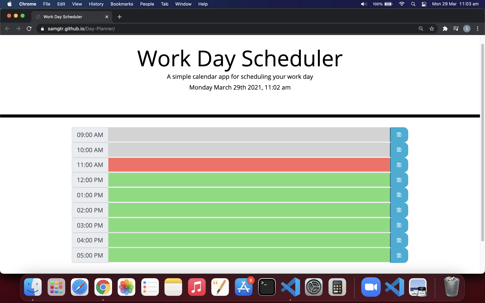
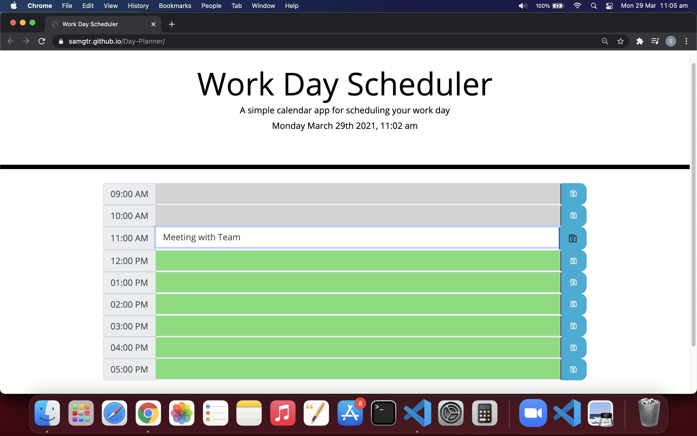
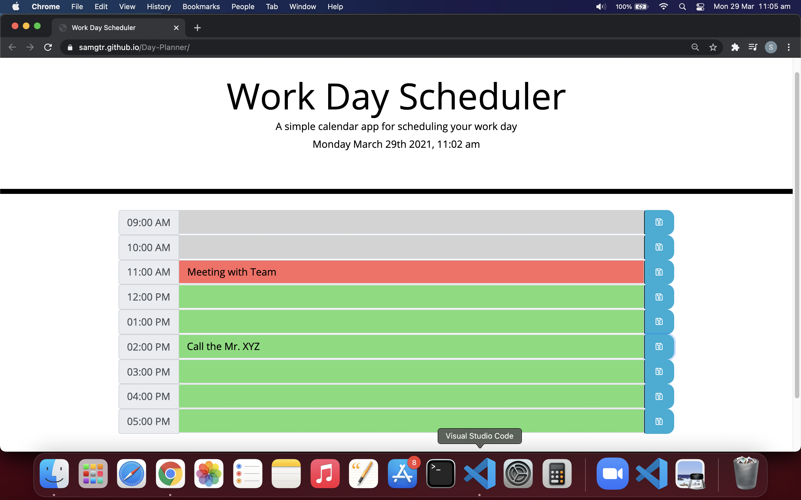

# Day-Planner

This web application is developed as Week-5 Homework requirement. 
This is a Day-Planner application designed using Javascript. The user is presented with a 9 blocks with time and save button. The header shows current date and time. User can enter the task which are requried to be carried out between 9AM to 5PM in this Day-Planner application and save them. When user clicks the save button, the task detail in respective time-block is saved in local storage.

## Installation

- Git clone the application from : https://github.com/SamGTR/Day-Planner.git
- Navigate to the index.html.
- Open the index.html file with any web browser.

## Description

This applicationw is developed using HTML, CSS and Javascript files. The features of the application are as below:

- On running the application, user is presented with browser layout with information about current date and time. Also, there are 9 time-blocks with time 9AM to 5PM.

- The current hour is shown with red color. The past hours are shown with grey color. The upcoming hours are shown as green color.

- The user can click in any of the block to enter the task or activity details. After entering the details, the user is required to press the save button next to respective time-block.

- If the user want to delete an activity from day-planner then the activity is required to be deleted from particular time-block and save button must be pressed.

## Technology

The web application is developed using HTML, CSS and Javascript files. 
- The HTML file links bootstrap, moment.js and jQuery for functionality of the application.
- The CSS file contains styling elements of the application.
- The Javascript file uses Moment() for current time and other time calcualtions. Also, it has event listener, For loops and if/else statements for logic development. The js file also uses local storage for storing and retrieving the activity data.
- The application supports responsive layout for various screen sizes.

## Links

Following is the link to the Day-Planner application:  
https://samgtr.github.io/Day-Planner/

Following is the link to the Github repository for Day-Planner application:  
https://github.com/SamGTR/Day-Planner

## License

MIT
